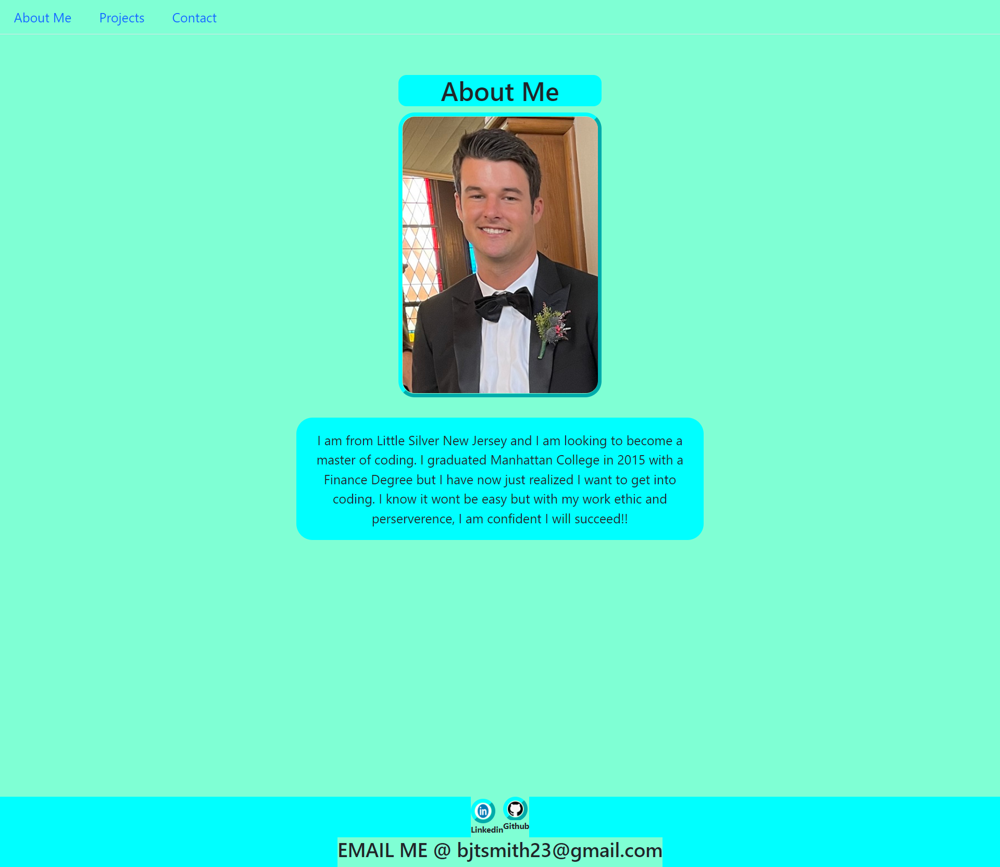
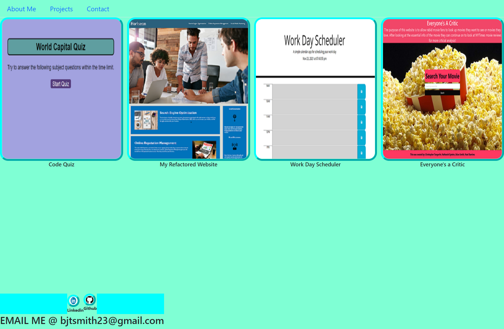

# React Portfolio

  ## Table of Contents
  - [Description](#Description)
  - [Installations](#Installations)
  - [Usage](#Usage)
  - [Tests](#Tests)
  - [License](#License)
  - [Questions](#Questions)
  ## Description
  The purpose of this project was to recreate the my existing portfoliowith another portfolio using react and javascript. The user can come to my portfolio and see my Resume, my works/projects, ect. 
  ## Installations
  npm install inquirer, npm install
  ## Usage
  This repo can be used to view my works, my resume as well as click links to my Github and LinkedIn pages. My email can also be found at the bottom of the page so that I may be contacted.
  ## License
  
   
  This application uses MIT license. 
  ## Questions 
  If you have any questions or would like to contact me, you can [email](mailto:bjtsmith23@gmail.com) me
  or check out my [GitHub](https://github.com/bjtsmith23).

  ## Screenshots 

  

  

